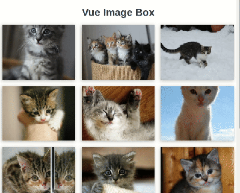

# vue-image-box

Lightweight and simple-ish image gallery component for Vue.js.

Images can also be cycled through using the left & right arrow keys, and closed with the escape key.

Demo: [vue-image-box.netlify.com](https://vue-image-box.netlify.com)



## Installation

CDN

`<script src="https://unpkg.com/vue-image-box"></script>`

NPM

`npm install vue-image-box`

## Usage

### props to send

- images
  - _object array_
  - Object Members: imageURL, thumbURL, caption
- index
  - _int_
  - Value: set to null
- bgcolor
  - _string_
  - Value: Any color (e.g. #000000, rgba(0, 0, 0, .8), hsla(0, 0%, 0%, .8), etc)

### methods available

- v-on:close
  - Current image closed (clicked X or pressed ESC)
  - Recommended: Set `index` value (from `data()`) to null
- v-on:previousImage
  - Current image changed to previous (index - 1, loops back to end of array)
- v-on:nextImage
  - Current image changed to next (index + 1, loops back to start of array)

### Example

This component works by waiting for `index` to be populated with a non-null value and displaying the full-size image associated with that index. Images are constructed from the (`images`) object array and the click handler updates the value of `index`, triggering the display of the larger modal of the image.

Vue Template:

```html
<template>
  <div>
    
    <ImageBox
      :images="images"
      :index="index"
      @close="index = null"
      :bgcolor="bgcolor"
    ></ImageBox>
  </div>
</template>
```

```javascript
<script>
import ImageBox from "vue-image-box";

export default {
  name: "app",
  components: {
    ImageBox
  },
  methods: {
    showImage: function(idx) {
      this.index = idx;
    }
  },
  data() {
    return {
      index: null,
      bgcolor: "rgba(51, 51, 51, .9)",
      images: [
        {
          imageUrl: "https://placekitten.com/800/600",
          thumbUrl: "https://placekitten.com/800/600",
          caption: "kitten #1"
        },
        {
          imageUrl: "https://placekitten.com/825/600",
          thumbUrl: "https://placekitten.com/825/600",
          caption: "kitten #2"
        },
        {
          imageUrl: "https://placekitten.com/803/600",
          thumbUrl: "https://placekitten.com/803/600",
          caption: "kitten #3"
        }
      ]
    };
  }
};
</script>
```

## Author

Adam Romig

## License

vue-image-box is available under the MIT license. See the LICENSE file for details.
